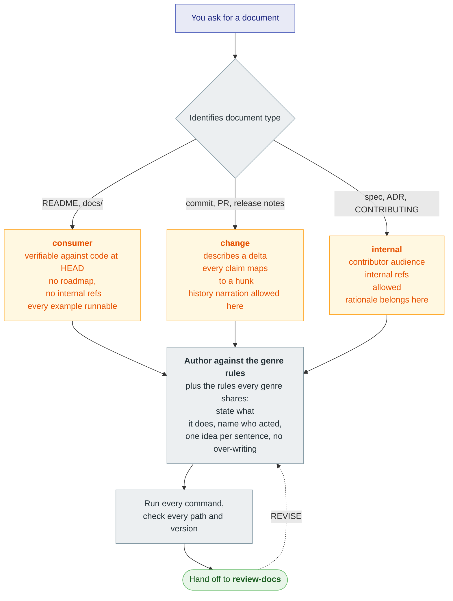
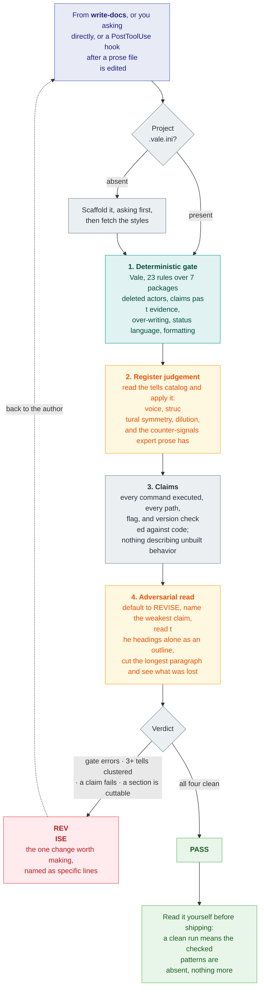

# slopvac

Remove AI writing patterns from prose.

AI generated documentation has a clear fingerprint: contrastive inversions, adjectives nothing
measures, rationale that belongs in a decision record, roadmap language for something
that does not ship yet, excessive hedging, and so on. 

This package ships two skills. 

`write-docs` classifies a document by genre and authors against that
genre's rules. 

`review-docs` gates a document with a deterministic
[Vale](https://vale.sh) pass, judges the register against a catalog of tells no regex
reaches, and returns a verdict. Either can alone. Hooks carry the same rules into
every subagent and gate prose files as they are edited.

Works with Claude Code, Codex, and Kiro.

## Quick start

Needs [`vale`](https://vale.sh) on `PATH` (`brew install vale`, or
`mise use -g vale`).

**Claude Code**

```
claude plugins marketplace add srobroek/slopvac --scope user
claude plugins install slopvac@slopvac --scope user
```

**Codex**

```
codex plugin marketplace add srobroek/slopvac
codex plugin add slopvac@slopvac
```


**Kiro, or anywhere you already use [APM](https://microsoft.github.io/apm/)**

```sh
apm marketplace add srobroek/slopvac --name slopvac --global
apm install slopvac@slopvac --target kiro --global   # or claude, or codex
```

No APM installed? `uvx --from apm-cli apm ...` runs those two commands from PyPI.
Project scope, installing by hand, and the per-harness detail are under
[Install](#install).

Then ask the agent: *"write the README for this package"*, or *"review this
README"*. It scaffolds a `.vale.ini` on first use and asks before writing.

## How it works

You ask the agent for a document, or to review one. The agent runs the gate and the
judgement pass.

### Write a document



### Review a document




The `SubagentStart` hook injects the rules
into every subagent, because a subagent inherits main-session steering weakly.
`PostToolUse` gates prose files after an edit, accumulating changes and returning
`file:line` findings once they cross a threshold.

## Patterns it catches

Two layers, because half of this resists mechanization.

**Deterministic** -- Vale rules over parsed prose, each one tested and calibrated
against a real corpus.

<!-- BEGIN GENERATED: rule-counts -->
63 rules across 9 styles. 28 sit on the slop axis and gate at error. 35 sit on the craft axis and warn.
<!-- END GENERATED: rule-counts -->

Plus `ai-tells`: 76 upstream rules from
[tbhb/vale-ai-tells](https://github.com/tbhb/vale-ai-tells), with the exclusions a
software corpus needs applied. Vale's built-in `Vale.Repetition` covers "the the".

<!-- BEGIN GENERATED: styles-table -->
| Style | Axis | Rules | Catches |
|---|---|---|---|
| `ai-residue` | slop | `ChatLeakage` | Assistant output pasted into a shipped document |
| `docs-discipline` | slop | `HistoryNarration`, `InternalRefs`, `StatusLanguage` | Documentation describing something other than the released artifact |
| `prose-agency` | slop | `AgentlessPassive`, `Anthropomorphism`, `FalseAgency`, `NarratorDistance`, `UnattributedRecommendation` | Prose with the actor deleted |
| `prose-craft` | craft | `AcronymPeriods`, `Ambiguity`, `Annotations`, `Articles`, `CommandPrompt`, `ConflictMarkers`, `DeadOpener`, `DirectionalRef`, `FirstPersonPlural`, `FutureTense`, `GerundHeading`, `Hyphens`, `Latinisms`, `LinkText`, `Misnomer`, `NegativeRequirement`, `OptionalPlural`, `Ordinals`, `PluralAbbreviation`, `Politeness`, `Redundancy`, `RelativeDate`, `SelfReference`, `SentenceLength`, `Spacing`, `UnclearAntecedent`, `UndefinedAcronym`, `Versions`, `Wordiness` | Writing craft: wordiness, structure, and mechanics, in any register |
| `prose-density` | craft | `Overwritten`, `PassiveDensity`, `SentenceLoad` | Prose too dense to read in one pass |
| `prose-format` | slop | `EmojiHeading`, `NoUnicodeDash`, `ProseBlock` | Formatting tells |
| `prose-inclusive` | craft | `Ableist`, `DeviceAssumption`, `Exclusive` | Language that excludes a reader who could otherwise use the doc |
| `prose-inflation` | slop | `AdditiveHedge`, `Apologizing`, `BorderlineHype`, `BusinessJargon`, `DocumentPreamble`, `HedgeStack`, `Intensifier`, `NominalizedVerb`, `SlopLexicon`, `Uncomparables`, `VagueDeclarative`, `VagueQuantifier` | Claims inflated past their evidence |
| `prose-scope` | slop | `Epigram`, `ImplementationLeak`, `RejectedAlternative`, `UnrequestedReassurance` | Over-writing: real content in the wrong document |
<!-- END GENERATED: styles-table -->

Slop-axis rules gate at error, because a match says something about how the text
was produced. Craft-axis rules warn instead. The writing is worse either way, but a
wordy sentence should not block a release.

The full rule reference lists every rule with its level and check type:
[vale-styles/README.md](vale-styles/README.md#every-rule). It is generated from the
rule files, so it cannot go stale.

**Agentic** -- the skill reads a catalog of tells no regex reaches, and applies them
by judgement:

| Category | Examples |
| --- | --- |
| Register | Faux-candor pivots, punchy-fragment cadence, corporate-analytic filler, figurative-verb verdicts, sycophantic residue |
| Structure | Contrastive inversion, tricolon abuse, false-suspense transitions, meta-narration, heading echo |
| Formatting | Em-dash density, bold spray, inline-header lists, tables wrapping one sentence |
| Content shape | Fabricated citations, fake specificity, one-point dilution, padded symmetry, vaporware description |
| Counter-signals | What expert prose has and generated prose lacks: non-round numbers, named specifics, an unhedged stance, asymmetric structure |

A document passes when both layers agree.

## Limits

A clean run means the checked patterns are absent, and nothing more. Neither layer
reads for truth. A sentence can pass every rule and still name a function absent
from the code, or describe a flag that never shipped. Judgement of the register is a model reading a catalog, so it misses tells
and occasionally objects to prose that is fine.

Read the text before you ship it. The gate removes the patterns you would otherwise
spend attention on, so that the attention goes to whether the document is correct.

## Install

Needs `vale` on `PATH`:

```sh
mise use -g vale     # or: brew install vale
```

`ast-grep` is optional and extends the gate to JSX text nodes.

### Claude Code

Native plugin:

```
/plugin marketplace add srobroek/slopvac
```

With APM:

```sh
apm marketplace add srobroek/slopvac --name slopvac
apm install slopvac@slopvac --target claude --global   # every project
apm install slopvac@slopvac --target claude            # this project only
```

By hand, into `~/.claude` for every project or `.claude` for one:

```sh
git clone https://github.com/srobroek/slopvac /tmp/slopvac
mkdir -p .claude/skills .claude/hooks
cp -R /tmp/slopvac/.apm/skills/* .claude/skills/
cp -R /tmp/slopvac/scripts .claude/hooks/slopvac/
```

Then copy the events and matcher from `hooks/hooks.json` into
`.claude/settings.json`.

### Codex

Native plugin:

```
plugin marketplace add srobroek/slopvac
```

With APM:

```sh
apm marketplace add srobroek/slopvac --name slopvac
apm install slopvac@slopvac --target codex --global
```

By hand: as above, replacing `.claude` with `.codex`.

### Kiro

With APM:

```sh
apm marketplace add srobroek/slopvac --name slopvac
apm install slopvac@slopvac --target kiro --global
```

Install writes the skills, the steering, and the hook manifests Kiro reads
natively. Do not run `apm compile --target kiro`: it also writes a root
`AGENTS.md` that Kiro does not read as steering, and overwrites one already there.

By hand, into `~/.kiro` for every project or `.kiro` for one:

```sh
git clone https://github.com/srobroek/slopvac /tmp/slopvac
mkdir -p .kiro/skills .kiro/hooks
cp -R /tmp/slopvac/.apm/skills/* .kiro/skills/
cp -R /tmp/slopvac/scripts .kiro/hooks/slopvac/
```

Kiro reads one file per hook under `.kiro/hooks/`; copy the events and matcher from
`hooks/hooks.json`.

### Any harness, without installing APM

`uvx` runs APM from PyPI:

```sh
uvx --from apm-cli apm marketplace add srobroek/slopvac --name slopvac
uvx --from apm-cli apm install slopvac@slopvac --target kiro --global
```

`--global` installs to `~/.claude`, `~/.codex`, or `~/.kiro`. Drop it to install
into the current project, which is what you want when the config belongs in version
control with the code. Install for more than one harness at once with `--target claude,codex,kiro`.

## Dependencies

| What | Needed for | Without it |
| --- | --- | --- |
| [`vale`](https://vale.sh) 3.x | The whole deterministic gate. Everything else is configuration for it. | The gate exits 2 and names the install command; the skill still applies its judgement rules by reading |
| `python3` 3.12+ | The `PostToolUse` hook and the finding reporter, both stdlib only | The hook exits quietly; the gate is unaffected |
| `jq` | The `SubagentStart` hook, to build its JSON payload | That hook warns on stderr and skips, so a spawn is never blocked |
| [`ast-grep`](https://ast-grep.github.io) | Extracting prose from `.tsx` and `.jsx`, which Vale cannot parse | Those files are reported as unchecked rather than passed silently |
| `bash` 3.2+ | The gate and scaffold scripts. Stock macOS bash is the floor, so no `mapfile` | -- |
| `git` | Resolving the repo root and honouring `.gitignore` | Ignored files get linted too |

The skills need none of this to be installed by APM; the gate needs `vale` at the
point it runs.

### Rule sources

`vale sync` fetches the style packages listed under
[What it catches](#what-it-catches). All but one are built from `vale-styles/` in
this repo; `ai-tells` comes from
[tbhb/vale-ai-tells](https://github.com/tbhb/vale-ai-tells) (MIT), whose 76 rules
arrive with the exclusions a software corpus needs already applied. The lexical rules in `prose-inflation` were harvested from
[hardikpandya/stop-slop](https://github.com/hardikpandya/stop-slop) (MIT).

Development adds `pytest`, `bats`, `actionlint`, `zizmor`, `yamllint`, and
`shellcheck`, all pinned in the workflows.

## Configuration

The gate reads one file, `.vale.ini` at your project root, and the project owns it.
The agent scaffolds it on first use and asks before writing. It is committed; the
fetched `.vale-styles/` directory is not.

Take new upstream rules with `vale --config=.vale.ini sync`. Every URL in the file
points at a rolling release tag, so a sync is the whole update.

### Override a rule

Put the line inside the section it applies to, normally `[*.{md,mdx}]`: a rule line
binds to that section it, so one appended at the end of the file attaches to
the last section instead.

```ini
[*.{md,mdx}]
BasedOnStyles = ai-residue, prose-agency, prose-inflation, prose-scope, docs-discipline, prose-format, ai-tells

prose-scope.ImplementationLeak = NO        # latency is the product; we publish it
prose-format.NoUnicodeDash = NO            # house style uses real em dashes
prose-inflation.BusinessJargon = warning   # advisory, not a gate
```

| Scope | Change |
| --- | --- |
| One rule off | `rule = NO` |
| Advisory only | `rule = warning` |
| A whole style | drop it from that section's `BasedOnStyles` |
| One path | `[**/generated/**]` then `BasedOnStyles =` |
| One passage | `<!-- vale rule = NO -->` ... `<!-- vale rule = YES -->`, each on its own line |

Decision records invert some rules: a spec, a design record, or CONTRIBUTING is
where a rationale and its measurement belong, so those paths already exempt
`prose-scope` and the internal-reference rule.

## Using the styles without an agent

Every package is a plain Vale style that installs on its own. A project that wants
`prose-agency` and none of the house genre rules takes just that one:

```ini
StylesPath = .vale-styles
MinAlertLevel = warning
Packages = https://github.com/srobroek/slopvac/releases/download/vale-styles/prose-agency.zip

[*.md]
BasedOnStyles = prose-agency
```

Vale parses Markdown, MDX, HTML, JSON, and YAML, and it is syntax-aware for source
files: it lints comments and docstrings while skipping identifiers and string
literals, so a field named `robust` stays clean. `.mdx` needs `[formats]`
`mdx = md`, or Vale fails with `mdx2vast not found`.
`.tsx` and `.jsx` have no parser and no working alias, and Vale reports zero
findings and exits 0 for them, which reads as a pass -- the skill extracts their JSX
text with `ast-grep` instead.

See [vale-styles/README.md](vale-styles/README.md) for the full rule set.

## License

Apache-2.0. Bundles rules harvested from
[hardikpandya/stop-slop](https://github.com/hardikpandya/stop-slop) (MIT).
