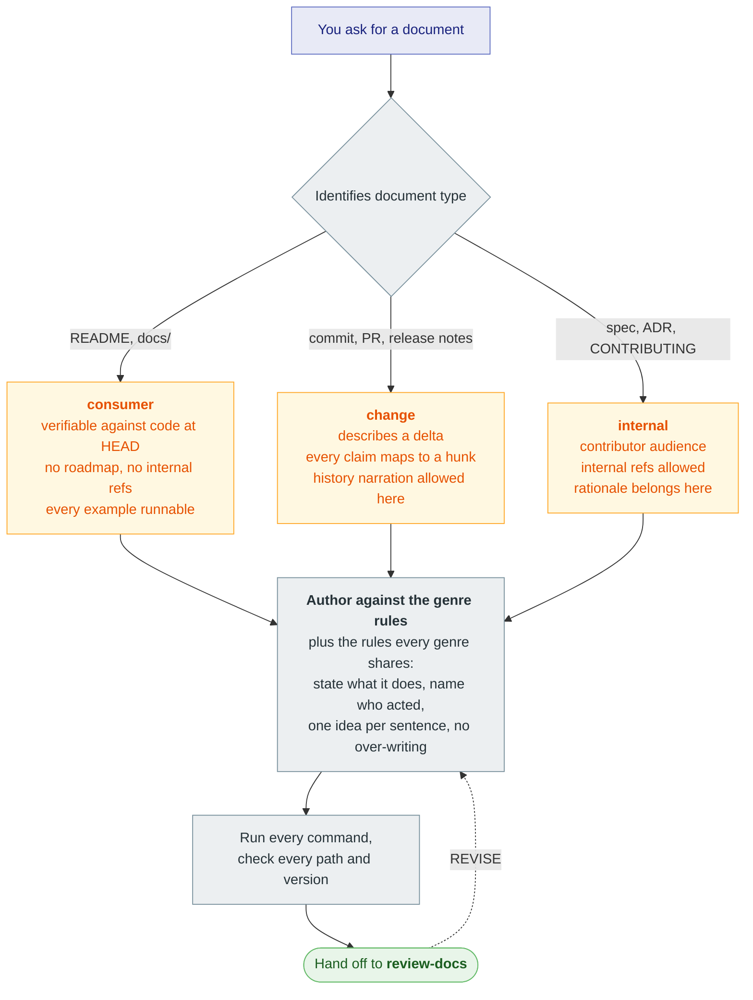
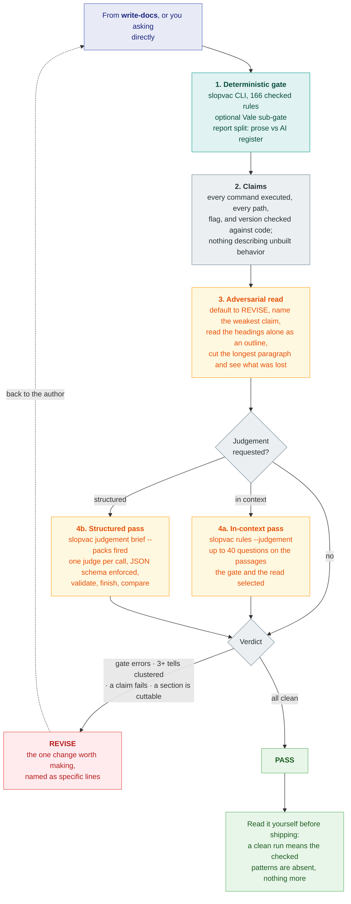
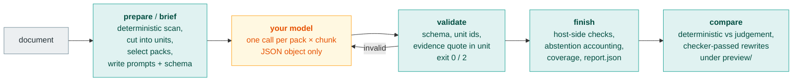

# slopvac

Remove AI writing patterns from prose.

AI generated documentation has a clear fingerprint. Contrastive inversions.
Adjectives nothing measures. Rationale that belongs in a decision record, roadmap
language for something that does not ship yet, and hedging on every claim.

This repository ships the `slopvac` CLI and two skills, `write-docs` and
`review-docs`. Works with Oh My Pi, Claude Code, Codex, and Kiro.

## Two layers

slopvac checks prose in two layers. They share one ruleset and one report, and
they make different promises.

| | Deterministic gate | Judgement layer |
| --- | --- | --- |
| Runs | `slopvac <files>` | `slopvac judgement …` plus a model you supply |
| Rules | 166 checked rules with a regex, token, or Vale checker | 65 judgement rules: a question, a fix, exemplars |
| Output | findings, density per 100 words, 0-100 score, exit code | per-unit confirm, reject, or abstain with an evidence quote |
| Repeatable | same input, same output, every run | model-dependent; measured flip rate 0.8-1.3 % |
| Gates | yes: exit 1 on a failed threshold | never: it may lower `judgement_adjusted_score`, nothing else |
| Model calls | none | `prepare` or `brief` writes prompts; your harness sends them |

The deterministic gate is what pre-commit and CI run. It is offline and answers
one question: are the named patterns present, and at what density.

The judgement layer covers the rules no pattern can express: dilution, false
range, faux candor, structural symmetry. It never produces a lint finding and
never changes pass or fail. The CLI does not call a provider. It writes prompts
with a JSON schema, and validates and aggregates what comes back. `review-docs`
runs it only when asked. [The judgement layer](#the-judgement-layer) describes
the design, the baselining, and the measured precision.

## Quick start

```sh
uvx slopvac README.md
```

Vale 3.15 or later on `PATH` runs the optional Vale sub-gate
(`brew install vale`, or `mise use -g vale`). Without it, or with
`--no-vale`, Vale-backed rules report as unchecked and the run exits 2.
Native findings stay in the report.

**Oh My Pi**

```sh
omp plugin marketplace add srobroek/slopvac
omp plugin install slopvac@slopvac --scope user
```

**Claude Code**

```
claude plugins marketplace add srobroek/slopvac --scope user
claude plugins install slopvac@slopvac --scope user
```

**Codex**

```
codex plugin marketplace add srobroek/slopvac
codex plugin add slopvac@slopvac
```

Project scope, local checkouts, and direct-copy instructions are under
[Install](#install).

Then ask the agent: *"write the README for this package"*, or *"review this
README"*.

## How it works

You ask the agent for a document, or to review one. The agent runs the gate,
reviews the claims and structure, and runs the judgement layer when you ask.

### Write a document



### Review a document



### The judgement pipeline



Every box except the model is deterministic and runs offline. The prompt holds
units, each with its rule question and exemplars. The response holds a verdict
per unit with a quote the host checks against the unit text.

## Categories

`slopvac` ships **231 rules** across **26 categories**: 166 checked, 65 judgement.
`slopvac rules` lists them, plus the spelling rule it generates for the configured
locale. The generated reference is
[`packages/slopvac-lint/docs/rules.md`](packages/slopvac-lint/docs/rules.md).

Reports show two axes. `prose` holds the deterministic craft findings.
`ai_register` holds the rules with a measured AI signal, split into strong and
weak. Judgement confirms use the same split. Neither axis changes scoring or
gates; the split tells you which findings are register and which are craft.

| Category | Checked | Judgement |
| --- | --: | --: |
| `ai-residue` | 1 | 0 |
| `ai-tells-agentic` | 1 | 0 |
| `ai-tells-content-shape` | 5 | 9 |
| `ai-tells-figurative` | 12 | 0 |
| `ai-tells-formatting` | 9 | 1 |
| `ai-tells-register` | 9 | 10 |
| `ai-tells-structure` | 15 | 19 |
| `docs-discipline` | 3 | 0 |
| `orwell` | 4 | 1 |
| `prose-agency` | 5 | 0 |
| `prose-craft` | 28 | 0 |
| `prose-discipline` | 6 | 5 |
| `prose-format` | 3 | 0 |
| `prose-inclusive` | 3 | 0 |
| `prose-inflation` | 12 | 0 |
| `prose-promotion` | 4 | 0 |
| `prose-scope` | 5 | 1 |
| `ste-descriptive` | 2 | 4 |
| `ste-nouns` | 1 | 1 |
| `ste-practices` | 9 | 3 |
| `ste-procedural` | 5 | 0 |
| `ste-punctuation` | 4 | 1 |
| `ste-safety` | 2 | 1 |
| `ste-sentences` | 5 | 2 |
| `ste-verbs` | 5 | 2 |
| `ste-words` | 9 | 6 |

Checked rules produce findings. Judgement rules do not. A reviewing agent reads
them from `slopvac rules --judgement`, or the judgement CLI renders them into
prompts.

A document passes when the CLI clears its thresholds and the review finds no
clustered register tells.

## The judgement layer

A rule either has a checker or it does not. "Explains one point in three ways"
or "asserts without bound what the author cannot know" has no regex. Dropping such
rules would redefine the standard as whatever a pattern can reach. Handing them
to a model without structure gives you an opinion you cannot audit. In the
judgement layer the model answers narrow questions on small units, and the host
owns everything around that answer.

### What the prompt contains

`prepare` (JSONL rows) or `brief` (a Markdown brief for an agent) runs the
deterministic scan first and cuts the document into units: sentences, paragraphs,
list items, table rows, headings, each with a stable id and offsets. Judgement
rules are grouped into packs by category and split into chunks; each pack × chunk
is one call. `--packs fired` selects only packs whose category produced a
deterministic finding on the target. On the README used to test it, that cut
the run from 156 calls to 65.

Each call carries the shared system text, the rule's question, its fix, its
exemplars, and the units as `passages` and `pairs`. The response schema is
fixed: for each unit, `confirm`, `reject`, or `abstain`, a rule id, and an
evidence quote. `--max-calls` (300) refuses a run above budget before writing
prompts.

### What the host checks

The host does not trust the response. `validate` checks one call and exits 0 or
2; it accepts a bare response or a hook payload. `finish` checks the whole run.
Both apply the same checks:

- The JSON parses and matches the schema. An unknown unit id, or a unit id from
  another call, fails the row.
- The evidence quote occurs in the unit text. A quote that occurs exactly once
  is relocated to its offsets (`unique-quote` salvage); a quote that does not
  occur fails the unit. Salvage changed 1,294 offset mismatches to 4 on the
  evaluation corpus and added 175 confirms without changing semantic precision.
- Failed, truncated, and not-run units stay in their own states. They reduce
  reported coverage and are never counted as abstentions; only an explicit model
  abstention is. A document is `PARTIAL` when any unit is missing.
- Confirms and rejects are aggregated per rule and per document.
  `judgement_adjusted_score` may drop; deterministic pass/fail, exit status,
  and the `max_errors` gate are not touched.

`compare` puts deterministic findings and judgement confirms side by side and,
with `--apply-preview`, writes rewrites under `preview/` only when the
deterministic checker passes the rewritten text.

### Baselining

A model verdict has three failure modes: it flips between runs, it confirms
human prose, and it confirms with a quote that does not support the rule. Each
has its own instrument.

**Noise floor.** The runner judges a registered 20 % subsample three times with
the same instrument. The instrument fingerprints the model id, `max_tokens`, the
prompt bytes, and the schema. A changed prompt is a new instrument and cannot
reuse old rows. The report gives per-rule flip rate over complete units and
classifies incomplete repeats separately (`provider_error`, `schema_invalid`,
`unknown_unit`).

Measured: 0.79 % overall on the v2 instrument (strict), 1.27 % on the 1,416
complete units of the r2 subsample. The separate `decide` step turns that into
policy: majority-of-3 on confirms applies only to a rule with flip rate above
10 % and at least 30 complete units. On the v2 instrument no rule qualifies, so
every rule stays single-call and the record says why.

**Human-prose arm.** Style rules fire on human prose, so a confirm on a
pre-2022 human document is a screening signal, not a false positive. The arm
reports confirms per attempted unit per rule; the preregistered threshold is
0.05 confirms per 1,000 words. Top rule on the v1 instrument:
`absolute-assertion-remainder`, 13 confirms over 3,447 attempted units (0.38 %).

**Blinded adjudication.** A confirm is only a true positive when an independent
reader agrees with it. `adjudicate` sends each human-class confirm, with its
quote and unit, to a model from another family (`openai.gpt-5.6-sol`, high
reasoning) three times and takes the majority verdict. Precision is true
positives over adjudicated confirms. False-positive incidence is false positives
over attempted human units. The repeat measurement (60 confirms × 3) found 6
flipped units, a 0.100 flip rate, and 4/11 agreement with earlier single-pass
labels on one rule. Adjudication therefore requires three repeats.

### Evaluation

The corpus is preregistered and frozen (`wider/manifest.json`): 36 human
documents written before 2022 (333,870 words after conversion) and 8 documents
with stated LLM authorship (133,900 words), stratified by genre. The judge is
`global.anthropic.claude-fable-5-1` on Bedrock, `max_tokens` 32,000, run through
the repeatable batch runner. Every number below names its denominator in the
[evaluation record](packages/slopvac-lint/docs/research/rubric-2026-09-15/evaluation/2026-09-19-wider-evaluation.md).

| | v1 (questions only) | v2 (criteria and exemplars rendered) |
| --- | --- | --- |
| Units in scope | 44,700 | 47,856 (43,848 shared with v1) |
| LLM arm | 2,265 calls, 306 confirms, 42,039 rejects, 4,836 abstains | recorded per rule in `v2/analysis/` |
| Human arm | 36 docs, 45 confirms, 4,433 abstains | 60 confirms adjudicated |
| Adjudicated precision | not measured | 37 TP / 21 FP / 2 borderline: **65 %** |
| FP incidence (human units) | not measured | **0.06 %** |
| Noise floor | 1.27 % (r2, 3 repeats) | 0.79 % (strict) |

The 2026-09-22 extension added 12 more pre-2022 human documents (plain-language,
procedural, editorial): 36,896 attempted units, 49 confirms, 38 TP / 10 FP /
1 borderline (77.6 % TP share, 0.027 % FP incidence), repeat consistency 4 flips
in 49.

What the evaluation changed:

- `absolute-assertion-remainder` was the largest false-positive source on human
  documents (9 FP of 13 confirms). Its guidance now preserves quoted, attributed,
  time-bounded, and locally anaphoric claims. Re-judging the same units:
  human confirms 13 → 0, LLM confirms 19 → 7. The price was recall: all three
  adjudicated true positives were lost under the new guidance.
- `corporate-analytic-filler-remainder` (148 LLM confirms, top of the ranking)
  confirmed on plain analytic prose in the human arm. PR #151 retired it.
- `one-point-dilution` and the content-shape questions gained bounded guidance
  after the v2 adjudication.
- Evidence offsets from the model were wrong often enough that the host now
  relocates quotes itself.
- Every rule carries an `ai_signal` from these measurements: 10 strong, 78 weak,
  143 none. The signal is the second report axis.

What it does not claim: LLM-arm precision. The two independent blinded label sets
the preregistration requires are not complete, so confirms on stated-LLM
documents are reported as counts, not as precision. The human-arm cells are
small (four documents per genre in the extension). Treat the judgement layer as
advisory and the numbers above as the current measurement, not a guarantee.

## Limits

A clean lint run means that the checked patterns were not found. Verify claims
against code and cited sources. Model-based review can miss defects or flag
correct prose; [Evaluation](#evaluation) says how often, and on what.

Read the text before you ship it. The gate removes the patterns you would
otherwise spend attention on, so that the attention goes to whether the document
is correct.

## Install

### CLI

```sh
uv tool install slopvac     # persistent
uvx slopvac --help          # or run it without installing
pipx install slopvac
```

Vale 3.15 or later on `PATH` runs the Vale sub-gate. The CLI still scores native
rules when Vale is absent.

The full CLI contract lives in
[`packages/slopvac-lint/README.md`](packages/slopvac-lint/README.md).

### pre-commit

```yaml
repos:
  - repo: https://github.com/srobroek/slopvac
    rev: v2.2.0
    hooks:
      - id: slopvac
```

Also: `slopvac-strict` (`--profile strict`) and `slopvac-no-vale` (`--no-vale`).
`--no-vale` skips the Vale sub-gate. Vale-backed rules report as unchecked.

### GitHub Action

```yaml
- uses: srobroek/slopvac@v2.2.0
  with:
    paths: README.md docs/
    profile: normal
```

Inputs include `paths`, `profile`, `config`, `changed-files-only`, `min-score`,
`max-per-100-words`, `fail-on-findings`, `annotate`, `sarif`, `vale`, `version`,
and `source`. Outputs include `score`, `findings`, `errors`, `per-100-words`,
`passed`, `json`, and `sarif`.

### Oh My Pi

Install the native skills through the marketplace:

```sh
omp plugin marketplace add srobroek/slopvac
omp plugin install slopvac@slopvac --scope user
```

Use `--scope project` for one project. Start a new session after installation.
The `write-docs` and `review-docs` skills load through the `agent-plugins` provider;
the `claude-plugins` provider can remain disabled.

To use a local checkout:

```sh
git clone https://github.com/srobroek/slopvac
omp plugin link ./slopvac/packages/slopvac
```

### Claude Code

Run these commands to install the native plugin from the marketplace:

```
/plugin marketplace add srobroek/slopvac
/plugin install slopvac@slopvac
```

To install by hand in one project, copy skills into `.claude/skills`:

```sh
git clone https://github.com/srobroek/slopvac /tmp/slopvac
mkdir -p .claude/skills
cp -R /tmp/slopvac/packages/slopvac/skills/* .claude/skills/
```

### Codex

Install the native plugin from the slopvac marketplace with these commands:

```sh
codex plugin marketplace add srobroek/slopvac
codex plugin add slopvac@slopvac
```

To install by hand in one project, copy skills into `.codex/skills`:

```sh
git clone https://github.com/srobroek/slopvac /tmp/slopvac
mkdir -p .codex/skills
cp -R /tmp/slopvac/packages/slopvac/skills/* .codex/skills/
```

### Kiro

Kiro loads skills from `.kiro/skills`. Copy the canonical skills into one project:

```sh
git clone https://github.com/srobroek/slopvac /tmp/slopvac
mkdir -p .kiro/skills
cp -R /tmp/slopvac/packages/slopvac/skills/* .kiro/skills/
```

## Configuration

`slopvac init` writes a `slopvac.toml`. The CLI reads that file, or a
`[tool.slopvac]` table in `pyproject.toml`. Keys:

| Key | Effect |
| --- | --- |
| `profile` | `strict`, `normal` (default), or `relaxed` |
| `exclude` | gitignore-style paths the CLI never lints |
| `[thresholds]` | `max_errors`, `max_warnings`, `max_total_per_100_words`, `min_score` |
| `[categories]` | per-category `severity`, `max_per_100_words`, `weight` |
| `[rules]` | per-rule `severity` (`off`, `suggestion`, `warning`, `error`) |
| `[[overrides]]` | glob-scoped patches, applied in file order |
| `[locale]` | `default` (`en-US`, `en-GB`, `und`) and `allow` |
| `[vocabulary]` | `path` to a project blocklist; unset leaves word checks inert |
| `[vale]` | `enabled`, `binary`, `config` for the Vale sub-gate |

Profiles set document gates (`config.py` `profile_thresholds`):

| Profile | Density budget | Max errors | `min_score` |
| --- | --- | --- | --- |
| `strict` | 1.5 / 100 words | 0 | 85 |
| `normal` | 3.0 / 100 words | 0 | 70 |
| `relaxed` | 8.0 / 100 words | unlimited | none |

Suppress one finding with a reason from that rule's closed list:

```markdown
<!-- slopvac-allow: rule=orwell.stale-figure reason=quotation -->
```

`slopvac explain <id>` lists the valid reasons. A reason off the list is
reported rather than honoured.

Disable the next line, or a span:

```markdown
<!-- slopvac-disable-next-line -->
<!-- slopvac-disable -->
...
<!-- slopvac-enable -->
```

## Exit codes

| Code | Means |
| --- | --- |
| 0 | every selected rule ran and every threshold passed |
| 1 | a threshold failed |
| 2 | the run could not be trusted |

Exit 2 covers a bad config, an unloadable ruleset, a missing tool, and a skipped
Vale sub-gate (`--no-vale` or no `vale` binary). Native findings stay in the
report. Treat exit 2 as an incomplete check, not a pass.

## Development setup

Install `agnix` 0.52.2, then enable the staged instruction check in each worktree:

```sh
cargo install --locked agnix-cli --version 0.52.2
./scripts/install-agnix-hooks.py
```

The installer sets a worktree hook path and preserves existing hooks.
Before each commit, the hook validates the Git index.

## License

Apache-2.0. Bundles rules harvested from
[hardikpandya/stop-slop](https://github.com/hardikpandya/stop-slop) (MIT).
