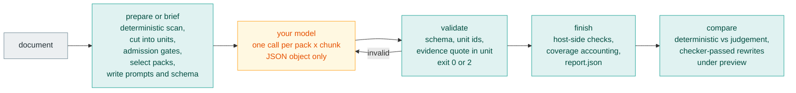

# slopvac

Remove AI writing patterns from prose.

AI generated documentation has a clear fingerprint. Contrastive inversions.
Adjectives nothing measures. Rationale that belongs in a decision record, roadmap
language for something that does not ship yet, and hedging on every claim.

This repository ships the `slopvac` CLI and two agent skills, `write-docs` and
`review-docs`. Works with Oh My Pi, Claude Code, Codex, and Kiro.

## Two layers

slopvac checks prose in two layers. They share one ruleset and one report, and
they make different promises.

| | Deterministic gate | Judgement layer |
| --- | --- | --- |
| Runs | `slopvac <files>` | `slopvac judgement …` plus a model you supply |
| Rules | 166 checked rules with a regex, token, or Vale checker | 65 judgement rules: a question, a fix, exemplars |
| Output | findings, density per 100 words, 0-100 score, exit code | per-unit confirm, reject, preserve, or abstain with an evidence quote |
| Repeatable | same input, same output, every run | model-dependent; measured flip rate 0.8-1.3 % |
| Gates | yes: exit 1 on a failed threshold | never: it may lower `judgement_adjusted_score`, nothing else |
| Model calls | none | `prepare` or `brief` writes prompts; your harness sends them |

The deterministic gate is what pre-commit and CI run. It is offline and answers
one question: are the named patterns present, and at what density.

The judgement layer covers the rules no pattern can express: dilution, false
range, faux candor, structural symmetry. It never produces a lint finding and
never changes pass or fail. The CLI does not call a provider. It writes prompts
with a JSON schema, and validates and aggregates what comes back. `review-docs`
runs it only when asked. [Methodology](#methodology) describes the process and
[The science](#the-science) the baselining behind it.

## Quick start

```sh
uvx slopvac README.md
```

Vale 3.15 or later on `PATH` runs the optional Vale sub-gate
(`brew install vale`, or `mise use -g vale`). Without it, or with
`--no-vale`, Vale-backed rules report as unchecked and the run exits 2.
Native findings stay in the report.

Install the skills into your agent harness:

```sh
# Oh My Pi
omp plugin marketplace add srobroek/slopvac
omp plugin install slopvac@slopvac --scope user

# Claude Code
claude plugins marketplace add srobroek/slopvac --scope user
claude plugins install slopvac@slopvac --scope user

# Codex
codex plugin marketplace add srobroek/slopvac
codex plugin add slopvac@slopvac
```

Then ask the agent: *"write the README for this package"*, or *"review this
README"*. Project scope, local checkouts, Kiro, and direct-copy instructions are
under [Usage](#usage).

## How it works

You ask the agent for a document, or to review one. The agent runs the gate,
reviews the claims and structure, and runs the judgement layer when you ask.

### Write a document


### Review a document


## Usage

### CLI

```sh
uv tool install slopvac     # persistent
uvx slopvac --help          # or run it without installing
pipx install slopvac
```

```sh
slopvac README.md docs/                 # gate, text report
slopvac --profile strict docs/          # tighter thresholds
slopvac --format json docs/ | jq .summary
slopvac --fix README.md                 # apply single-alternative rewrites
slopvac rules                           # every rule, checked and judgement
slopvac rules --judgement               # the 65 judgement rules
slopvac explain prose-craft.relative-date
```

The full CLI contract, output formats, profiles, and scoring are in
[`packages/slopvac-lint/README.md`](packages/slopvac-lint/README.md).

### pre-commit

```yaml
repos:
  - repo: https://github.com/srobroek/slopvac
    rev: v2.9.1
    hooks:
      - id: slopvac
```

Also: `slopvac-strict` (`--profile strict`) and `slopvac-no-vale` (`--no-vale`).
`--no-vale` skips the Vale sub-gate. Vale-backed rules report as unchecked.

### GitHub Action

```yaml
- uses: srobroek/slopvac@v2.9.1
  with:
    paths: README.md docs/
    profile: normal
```

Inputs include `paths`, `profile`, `config`, `changed-files-only`, `min-score`,
`max-per-100-words`, `fail-on-findings`, `annotate`, `sarif`, `vale`, `version`,
and `source`. Outputs include `score`, `findings`, `errors`, `per-100-words`,
`passed`, `json`, and `sarif`.

### Agent harnesses

**Oh My Pi.** Install through the marketplace, then start a new session:

```sh
omp plugin marketplace add srobroek/slopvac
omp plugin install slopvac@slopvac --scope user   # or --scope project
```

The `write-docs` and `review-docs` skills load through the `agent-plugins`
provider; the `claude-plugins` provider can remain disabled. For a local
checkout: `omp plugin link ./slopvac/packages/slopvac`.

**Claude Code.**

```
/plugin marketplace add srobroek/slopvac
/plugin install slopvac@slopvac
```

**Codex.**

```sh
codex plugin marketplace add srobroek/slopvac
codex plugin add slopvac@slopvac
```

**Kiro, or any harness by hand.** Copy the skills into the harness's skills
directory (`.claude/skills`, `.codex/skills`, `.kiro/skills`):

```sh
git clone https://github.com/srobroek/slopvac /tmp/slopvac
mkdir -p .kiro/skills
cp -R /tmp/slopvac/packages/slopvac/skills/* .kiro/skills/
```

### Configuration

`slopvac init` writes a `slopvac.toml`. The CLI reads that file, or a
`[tool.slopvac]` table in `pyproject.toml`. Keys:

| Key | Effect |
| --- | --- |
| `profile` | `strict`, `normal` (default), or `relaxed` |
| `exclude` | gitignore-style paths the CLI never lints |
| `[thresholds]` | `max_errors`, `max_warnings`, `max_total_per_100_words`, `min_score` |
| `[categories]` | per-category `severity`, `max_per_100_words`, `weight` |
| `[rules]` | per-rule `severity` (`off`, `suggestion`, `warning`, `error`) |
| `[[overrides]]` | glob-scoped patches, applied in file order |
| `[locale]` | `default` (`en-US`, `en-GB`, `und`) and `allow` |
| `[vocabulary]` | `path` to a project blocklist; unset leaves word checks inert |
| `[vale]` | `enabled`, `binary`, `config` for the Vale sub-gate |

Profiles set document gates:

| Profile | Density budget | Max errors | `min_score` |
| --- | --- | --- | --- |
| `strict` | 1.5 / 100 words | 0 | 85 |
| `normal` | 3.0 / 100 words | 0 | 70 |
| `relaxed` | 8.0 / 100 words | unlimited | none |

Suppress one finding with a reason from that rule's closed list:

```markdown
<!-- slopvac-allow: rule=orwell.stale-figure reason=quotation -->
```

`slopvac explain <id>` lists the valid reasons. A reason off the list is
reported rather than honoured.

Disable the next line, or a span:

```markdown
<!-- slopvac-disable-next-line -->
<!-- slopvac-disable -->
...
<!-- slopvac-enable -->
```

### Exit codes

| Code | Means |
| --- | --- |
| 0 | every selected rule ran and every threshold passed |
| 1 | a threshold failed |
| 2 | the run could not be trusted |

Exit 2 covers a bad config, an unloadable ruleset, a missing tool, and a skipped
Vale sub-gate (`--no-vale` or no `vale` binary). Native findings stay in the
report. Treat exit 2 as an incomplete check, not a pass.

## Methodology

### Rules and categories

`slopvac` ships **231 rules** across **26 categories**: 166 checked, 65 judgement.
Every rule, both kinds, lives in one place:
[`packages/slopvac-lint/src/slopvac/rules/*.yml`](packages/slopvac-lint/src/slopvac/rules).
A judgement rule is an entry with `kind: judgement` next to the checked rules of
its category. Most are the `-remainder` of a `-core` pattern rule. The pattern
catches the shapes a regex can name; the remainder asks the model about the
shapes it cannot. `slopvac rules` lists them all, plus the spelling rule it
generates for the configured locale. The generated reference is
[`docs/rules.md`](packages/slopvac-lint/docs/rules.md).

| Category | Checked | Judgement |
| --- | --: | --: |
| `ai-residue` | 1 | 0 |
| `ai-tells-agentic` | 1 | 0 |
| `ai-tells-content-shape` | 5 | 9 |
| `ai-tells-figurative` | 12 | 0 |
| `ai-tells-formatting` | 9 | 1 |
| `ai-tells-register` | 9 | 10 |
| `ai-tells-structure` | 15 | 19 |
| `docs-discipline` | 3 | 0 |
| `orwell` | 4 | 1 |
| `prose-agency` | 5 | 0 |
| `prose-craft` | 28 | 0 |
| `prose-discipline` | 6 | 5 |
| `prose-format` | 3 | 0 |
| `prose-inclusive` | 3 | 0 |
| `prose-inflation` | 12 | 0 |
| `prose-promotion` | 4 | 0 |
| `prose-scope` | 5 | 1 |
| `ste-descriptive` | 2 | 4 |
| `ste-nouns` | 1 | 1 |
| `ste-practices` | 9 | 3 |
| `ste-procedural` | 5 | 0 |
| `ste-punctuation` | 4 | 1 |
| `ste-safety` | 2 | 1 |
| `ste-sentences` | 5 | 2 |
| `ste-verbs` | 5 | 2 |
| `ste-words` | 9 | 6 |

Three sources feed the ruleset. `ai-tells-*` and `ai-residue` come from a
catalog of observed AI register. `ste-*` restates ASD-STE100 Simplified Technical
English as testable rules. `orwell` restates Orwell's six rules as objective
tests. `prose-*` and `docs-discipline` are craft and documentation-genre rules.

Every rule also carries an `ai_signal`: `strong` when the human-corpus
measurement below shows it fires on stated-LLM prose and not on human prose,
`weak` when the catalog claims it but the measurement is inconclusive, `none`
for craft rules. Reports roll findings up on two axes, `prose` and
`ai_register`, so you can see whether a document's problem is register or
craft. Neither axis changes scoring or gates.

### Scoring

The gate does not demand zero findings. It measures density: findings per 100
words, per category and overall, against the profile's budget. A 3,000-word
document with two passive sentences is fine; a 300-word one with the same two is
not. Errors have a separate hard cap (`max_errors`, 0 in `strict` and `normal`).
The 0-100 score weights categories and is the number `min_score` gates on. The
formulas are in the package README under
[Scoring](packages/slopvac-lint/README.md#scoring).

### The judgement layer

A rule either has a checker or it does not. "Explains one point in three ways"
or "asserts without bound what the author cannot know" has no regex. Dropping
such rules would redefine the standard as whatever a pattern can reach. Handing
them to a model as "review this document" gives you an opinion you cannot audit.
The judgement layer sits between: the model answers narrow, pre-registered
questions about small units of text, and the host owns everything around that
answer.



Every box except the model is deterministic and runs offline.

**1. Cut the document into units.** `prepare` parses the document into blocks:
paragraphs, list items, table rows, headings. Each judgement rule declares a
`scope`, so a sentence-scoped rule such as `absolute-assertion-remainder` gets
one unit per sentence, a paragraph-scoped rule such as `one-point-dilution` gets
one per block, and a table rule gets one per cell. A unit carries a stable id
(a hash of its normalised text, kind, and occurrence), its byte range in the
source, and a context window of the adjacent blocks; never the whole document.

Units exist for three reasons. A question about one sentence is decidable; a
question about a document is taste. A verdict on a unit can be checked: the
evidence quote either occurs in that unit or it does not. And a unit is the
denominator: confirms per attempted unit is what makes a rule's behaviour on
human prose comparable to its behaviour on generated prose.

**2. Admission gates.** Before any prompt is written, the host drops units the
model should not see and marks units it must not flag. Empty text, fragments
under three words, heading lines, and text that starts mid-word are dropped.
Generated, vendored, and template regions are dropped. Quoted passages and
worked examples are marked `PRESERVE` for rules that protect quoted specimens;
normative sentences (`MUST`, `NEVER`) are marked `PRESERVE` for rules that
protect obligations. What remains is `ELIGIBLE`.

**3. Packs and calls.** The 65 judgement rules are grouped into packs: the
local-scope rules of one category, four rules per pack (`SPAN-ai-tells-structure-1`,
`-2`, …), plus the document-scope probe packs. One call covers one
pack and up to five passages; each passage carries one pair per rule in the
pack. `--packs fired` selects only packs whose category produced a deterministic
finding on the target, which is what `review-docs` uses. `--packs all` runs
everything. `--max-calls` (300) refuses a run above budget before writing a
prompt.

**4. The prompt.** The system text is the shared spine
([`judgement/spine.md`](packages/slopvac-lint/src/slopvac/judgement/spine.md))
plus the pack's rules rendered from the YAML: the `judgement_question`, the
`fix`, the `examples` with their preserve-or-flag notes, and what the rule
`protects`. The user payload is JSON: the passages with their context and
ranges, and the (unit, rule) pairs to decide. For each pair the model answers
four independent questions:

| Dimension | Question | Levels |
| --- | --- | --- |
| Fit | Does the shape this rule names occur in this unit? | absent, partial, ambiguous, unambiguous |
| Harm | What does a reader lose if it ships? | none, reader effort, misleading or blocking, unsafe or normative |
| Repair | Can it be removed or replaced without changing a fact? | authorial only, needs absent fact, local substitution, safe deletion |
| Warrant | What in the text makes this decidable rather than taste? | no exact quote, quote only, quote plus one particular, two located supports |

The verdict, `confirm`, `reject`, `preserve`, or `abstain`, follows from those
four, and each rule sets a `warrant_min`: a confirm with less warrant than the
rule demands is not a confirm. Abstention has named reasons
(`no_exact_evidence`, `needs_repository_fact`, `ambiguous_unit`, …) so that "the
model did not know" is counted, not hidden. Confidence is not requested; it is
not a measurement.

**5. Host checks.** The host does not trust the response. `validate` checks one
call and exits 0 or 2; it accepts a bare response or a Claude Code hook payload.
`finish` checks the whole run. Both apply the same checks:

- The JSON parses and matches the schema. An unknown unit id, or a unit id from
  another call, fails the row.
- The evidence quote occurs in the unit text. A quote that occurs exactly once is
  relocated to its true offsets (`unique-quote` salvage, because model offsets
  are unreliable); a quote that does not occur fails the unit.
- Failed, truncated, and not-run units stay in their own states. They reduce
  reported coverage and are never counted as abstentions. A document is `PARTIAL`
  when any unit is missing.
- Confirms and rejects are aggregated per rule and per document.
  `judgement_adjusted_score` may drop; deterministic pass/fail, exit status, and
  the `max_errors` gate are not touched.

**6. Compare and rewrite.** `compare` puts deterministic findings and judgement
confirms side by side. With `--apply-preview` it writes the model's proposed
rewrites under `preview/`, but only those the deterministic checker passes: a
rewrite that introduces a new finding is rejected.

The `review-docs` skill drives this as `brief` (prompts as a Markdown brief with
one section per call), one judge subagent per call with the schema enforced,
`validate` on each response, then `finish` and `compare`. Its verdict carries a
`Judgement:` line with confirms by rule, rewrites accepted, and coverage.

## The science

### Why two kinds of rule

A checked rule and a judgement rule make different promises. Pretending
otherwise produces the two failures this tool exists to prevent. A reader
believes a judgement rule gates their build, or an agent treats a
mechanical rule as a matter of opinion. So judgement rules ship in the same
ruleset, carry the same category and severity metadata, and **never produce a
finding**. A rule no tool can automate is not thereby less true.

### Why density

Zero tolerance for a style rule is a claim that the rule has no exceptions. Most
do not survive that claim. Density with a budget per profile lets a rule be
right in general and wrong in one sentence without failing the document. It
also lets `strict` and `relaxed` be the same rules at different budgets rather
than different rule sets.

### Baseline the model

A model verdict has three failure modes: it flips between runs, it confirms
human prose, and it confirms with a quote that does not support the rule. Each
has an instrument, and each instrument names its denominator.

**Noise floor.** The runner judges a registered 20 % subsample three times with
the same instrument. An instrument is the fingerprint of model id, `max_tokens`,
prompt bytes, and schema; a changed prompt is a new instrument and cannot reuse
old rows. The report gives per-rule flip rate over complete units and classifies
incomplete repeats separately (`provider_error`, `schema_invalid`,
`unknown_unit`). A separate `decide` step turns the measurement into policy:
majority-of-3 on confirms applies only to a rule with flip rate above 10 % and at
least 30 complete units.

**Human corpus.** Style rules fire on human prose, so a confirm on a document
written before 2022 is not automatically a false positive; it is a screening
signal. The evaluation corpus is preregistered and frozen: 36 human documents
written before 2022 (333,870 words after conversion) and 8 documents with stated
LLM authorship (133,900 words), stratified by genre. Every judgement rule runs
over both arms with the same instrument. The comparison is per rule, per
attempted unit. How often does this rule confirm on human prose? How often on
generated prose? Is the gap large enough to call the rule an AI signal? The
preregistered human-arm threshold is 0.05 confirms per 1,000 words. That
comparison is where each rule's `ai_signal` comes from.

**Blinded adjudication.** A human-arm confirm is a true positive only when an
independent reader agrees with it. `adjudicate` sends each such confirm, with
its quote and unit, to a model from another family (`openai.gpt-5.6-sol`, high
reasoning) three times and takes the majority verdict. Precision is true
positives over adjudicated confirms; false-positive incidence is false positives
over attempted human units. Three repeats are required because a single pass
agreed with itself on only 4 of 11 confirms on one rule.

### Current measurements

Judge: `global.anthropic.claude-fable-5-1` on Bedrock, `max_tokens` 32,000,
rule criteria and exemplars rendered into the prompt. Every number names its
denominator in the
[evaluation record](packages/slopvac-lint/docs/research/rubric-2026-09-15/evaluation/2026-09-19-wider-evaluation.md);
the method and instrument contract are in
[`docs/judgement-eval.md`](packages/slopvac-lint/docs/judgement-eval.md).

| Measure | Value | Denominator |
| --- | --- | --- |
| Units judged | 47,856 | corpus, both arms |
| Adjudicated precision, human arm | **65 %** | 37 TP / 21 FP / 2 borderline of 60 confirms |
| False-positive incidence, human arm | **0.06 %** | attempted human units |
| Noise floor, strict | 0.79 % | complete units, 3 repeats |
| Noise floor, r2 subsample | 1.27 % | 1,416 complete units |
| Rules with `ai_signal: strong` | 10 | 231 rules; 78 weak, 143 none |
| Rules on majority-of-3 policy | 0 | no rule exceeds the 10 % flip threshold |

Not claimed: LLM-arm precision. The two independent blinded label sets the
preregistration requires are not complete, so confirms on stated-LLM documents
are reported as counts, not as precision. Treat the judgement layer as advisory
and these numbers as the current measurement, not a guarantee.

### Limits

A clean lint run means that the checked patterns were not found. Verify claims
against code and cited sources. Model-based review can miss defects or flag
correct prose; [Current measurements](#current-measurements) says how often, and
on what.

Read the text before you ship it. The gate removes the patterns you would
otherwise spend attention on, so that the attention goes to whether the document
is correct.

## Development

```sh
uv sync --project packages/slopvac-lint
uv run --project packages/slopvac-lint --with pytest pytest packages/slopvac-lint/tests
```

The repository also ships agent configuration: the plugin manifests and the two
skills under `packages/slopvac/`. CI lints those files with
[agnix](https://github.com/agent-sh/agnix) 0.52.2 (`.agnix.toml`), a linter for
agent-facing Markdown and plugin manifests. To run the same check on staged
files before each commit:

```sh
cargo install --locked agnix-cli --version 0.52.2
./scripts/install-agnix-hooks.py
```

The installer sets a worktree hook path and preserves existing hooks. It is
optional; CI runs the same gate on every pull request.

## License

Apache-2.0. Bundles rules harvested from
[hardikpandya/stop-slop](https://github.com/hardikpandya/stop-slop) (MIT).
