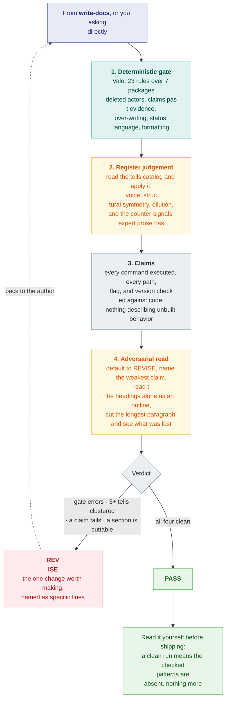

# slopvac

Remove AI writing patterns from prose.

AI generated documentation has a clear fingerprint. Contrastive inversions.
Adjectives nothing measures. Rationale that belongs in a decision record, roadmap
language for something that does not ship yet, and hedging on every claim.

This package ships two skills.

`write-docs` classifies a document by genre and authors against that
genre's rules.

`review-docs` gates a document with a deterministic
[Vale](https://vale.sh) pass, judges the register against a catalog of tells no regex
reaches, and returns a verdict. You can use either skill alone.

Works with Oh My Pi, Claude Code, Codex, and Kiro.

## Quick start

Needs [`vale`](https://vale.sh) on `PATH` (`brew install vale`, or
`mise use -g vale`).

**Oh My Pi**

```sh
omp plugin marketplace add srobroek/slopvac
omp plugin install slopvac@slopvac --scope user
```

**Claude Code**

```
claude plugins marketplace add srobroek/slopvac --scope user
claude plugins install slopvac@slopvac --scope user
```

**Codex**

```
codex plugin marketplace add srobroek/slopvac
codex plugin add slopvac@slopvac
```

Project scope, local checkouts, and direct-copy instructions are under
[Install](#install).

Then ask the agent: *"write the README for this package"*, or *"review this
README"*.

## How it works

You ask the agent for a document, or to review one. The agent runs the gate and the
judgement pass.

### Write a document


### Review a document



## Patterns it catches

Two layers, because half of this resists mechanization.

**Deterministic.** 23 Vale rules across seven packages, each one regex over parsed
prose, tested and calibrated against a real corpus.

| Package | Rules | Catches |
| --- | --- | --- |
| `prose-agency` | `FalseAgency`, `AgentlessPassive`, `NarratorDistance` | The actor deleted: an abstraction acting, a passive with no agent, or narration from outside the scene |
| `prose-inflation` | `SlopLexicon`, `BorderlineHype`, `VagueDeclarative`, `AdditiveHedge`, `BusinessJargon` | Claims past their evidence: marketing adjectives, significance without a specific, meeting-register verbs |
| `prose-scope` | `RejectedAlternative`, `ImplementationLeak`, `UnrequestedReassurance`, `Epigram` | Over-writing: a decision defended in place, a cost the reader cannot act on, an unraised worry answered, or an epigram closing a section that already concluded |
| `ai-residue` | `ChatLeakage` | Assistant output pasted into a shipped document |
| `docs-discipline` | `StatusLanguage`, `HistoryNarration`, `InternalRefs` | Text describing something other than the released artifact |
| `prose-format` | `EmojiHeading`, `NoUnicodeDash`, `ProseBlock` | Emoji headings, Unicode dashes, paragraphs that should be a list |
| `ai-tells` | 76 upstream | [tbhb/vale-ai-tells](https://github.com/tbhb/vale-ai-tells), with the exclusions a software corpus needs applied |

**Agentic.** The skill reads a catalog of tells no regex reaches, and applies them
by judgement:

| Category | Examples |
| --- | --- |
| Register | Faux-candor pivots, punchy-fragment cadence, corporate-analytic filler, figurative-verb verdicts, sycophantic residue |
| Structure | Contrastive inversion, tricolon abuse, false-suspense transitions, meta-narration, heading echo |
| Formatting | Em-dash density, bold spray, inline-header lists, tables wrapping one sentence |
| Content shape | Fabricated citations, fake specificity, one-point dilution, padded symmetry, vaporware description |
| Counter-signals | What expert prose has and generated prose lacks: non-round numbers, named specifics, an unhedged stance, asymmetric structure |

A document passes when both layers agree.

## Limits

A clean lint run means the checked patterns were not found. The agent must
still verify claims against code and cited sources. Model-based review can
miss defects or flag correct prose.

Read the text before you ship it. The gate removes the patterns you would otherwise
spend attention on, so that the attention goes to whether the document is correct.

## Install

Needs `vale` on `PATH`:

```sh
mise use -g vale     # or: brew install vale
```

`ast-grep` is optional and extends the gate to JSX text nodes.

### Oh My Pi

Install the native skills through the marketplace:

```sh
omp plugin marketplace add srobroek/slopvac
omp plugin install slopvac@slopvac --scope user
```

Use `--scope project` for one project. Start a new session after installation.
The `write-docs` and `review-docs` skills load through the `agent-plugins` provider;
the `claude-plugins` provider can remain disabled.

To use a local checkout:

```sh
git clone https://github.com/srobroek/slopvac
omp plugin link ./slopvac/packages/slopvac
```

### Claude Code

Install the native plugin:

```
/plugin marketplace add srobroek/slopvac
/plugin install slopvac@slopvac
```

By hand, into `.claude/skills` for one project:

```sh
git clone https://github.com/srobroek/slopvac /tmp/slopvac
mkdir -p .claude/skills
cp -R /tmp/slopvac/packages/slopvac/skills/* .claude/skills/
```

### Codex

Install the native plugin:

```sh
codex plugin marketplace add srobroek/slopvac
codex plugin add slopvac@slopvac
```

By hand, into `.codex/skills` for one project:

```sh
git clone https://github.com/srobroek/slopvac /tmp/slopvac
mkdir -p .codex/skills
cp -R /tmp/slopvac/packages/slopvac/skills/* .codex/skills/
```

### Kiro

Kiro loads skills from `.kiro/skills`. Copy the canonical skills into one project:

```sh
git clone https://github.com/srobroek/slopvac /tmp/slopvac
mkdir -p .kiro/skills
cp -R /tmp/slopvac/packages/slopvac/skills/* .kiro/skills/
```

## Dependencies

| What | Needed for | Without it |
| --- | --- | --- |
| [`vale`](https://vale.sh) 3.x | The whole deterministic gate. Everything else is configuration for it. | Without it the gate exits with the install command printed; the skill still applies its judgement rules by reading |
| [`ast-grep`](https://ast-grep.github.io) | Extracting prose from `.tsx` and `.jsx`, which Vale cannot parse | Those files are reported as unchecked rather than passed silently |
| `git` | Direct-copy installs from the repository | Native plugin installs are unaffected |

The skills are Markdown files loaded by each harness. The gate needs `vale` at the
point it runs.

### Rule sources

`vale sync` fetches the style packages listed under
[Patterns it catches](#patterns-it-catches). All but one are built from `vale-styles/` in
this repo; `ai-tells` comes from
[tbhb/vale-ai-tells](https://github.com/tbhb/vale-ai-tells) (MIT), whose 76 rules
arrive with the exclusions a software corpus needs already applied. The lexical rules in `prose-inflation` were harvested from
[hardikpandya/stop-slop](https://github.com/hardikpandya/stop-slop) (MIT).

Development adds `pytest`, `bats`, `actionlint`, `zizmor`, `yamllint`, and
`shellcheck`, all pinned in the workflows.

## Configuration

The gate reads one file, `.vale.ini` at your project root, and the project owns it.
The fetched `.vale-styles/` directory is not committed.

Take new upstream rules with `vale --config=.vale.ini sync`. Every URL in the file
points at a rolling release tag, so a sync is the whole update.

### Override a rule

Put the line inside the section it applies to, normally `[*.{md,mdx}]`: a rule line
binds to the section above it, so one appended at the end of the file attaches to
the last section instead.

```ini
[*.{md,mdx}]
BasedOnStyles = ai-residue, prose-agency, prose-inflation, prose-scope, docs-discipline, prose-format, ai-tells

prose-scope.ImplementationLeak = NO        # latency is the product; we publish it
prose-format.NoUnicodeDash = NO            # house style uses real em dashes
prose-inflation.BusinessJargon = warning   # advisory, not a gate
```

| Scope | Change |
| --- | --- |
| One rule off | `rule = NO` |
| Advisory only | `rule = warning` |
| A whole style | drop it from that section's `BasedOnStyles` |
| One path | `[**/generated/**]` then `BasedOnStyles =` |
| One passage | `<!-- vale rule = NO -->` ... `<!-- vale rule = YES -->`, each on its own line |

Decision records invert some rules: a spec, a design record, or CONTRIBUTING is
where a rationale and its measurement belong, so those paths already exempt
`prose-scope` and the internal-reference rule.

## Using the styles without an agent

Every package is a plain Vale style that installs on its own. A project that wants
`prose-agency` and none of the house genre rules takes just that one:

```ini
StylesPath = .vale-styles
MinAlertLevel = warning
Packages = https://github.com/srobroek/slopvac/releases/download/vale-styles/prose-agency.zip

[*.md]
BasedOnStyles = prose-agency
```

Vale parses Markdown, MDX, HTML, JSON, and YAML, and it is syntax-aware for source
files: it lints comments and docstrings while skipping identifiers and string
literals, so a field named `robust` stays clean. `.mdx` needs `[formats]`
`mdx = md`, or Vale fails with `mdx2vast not found`.
`.tsx` and `.jsx` have no parser and no working alias, and Vale reports zero
findings and exits 0 for them, which reads as a pass, so the skill extracts their JSX
text with `ast-grep` instead.

See [vale-styles/README.md](packages/slopvac-lint/vale-styles/README.md) for the
full rule set.

## Development setup

Install `agnix` 0.52.2, then enable the staged instruction check in each worktree:

```sh
cargo install --locked agnix-cli --version 0.52.2
./scripts/install-agnix-hooks.sh
```

The installer configures the hook path per worktree and preserves existing hooks. The
hook validates the Git index before each commit.

## License

Apache-2.0. Bundles rules harvested from
[hardikpandya/stop-slop](https://github.com/hardikpandya/stop-slop) (MIT).
