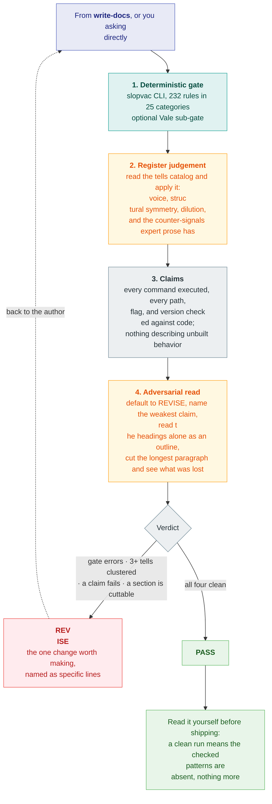

# slopvac

Remove AI writing patterns from prose.

AI generated documentation has a clear fingerprint. Contrastive inversions.
Adjectives nothing measures. Rationale that belongs in a decision record, roadmap
language for something that does not ship yet, and hedging on every claim.

This repository ships the `slopvac` CLI and two skills.

The CLI scores prose against 232 rules in 25 categories. Configure it with
`slopvac.toml`. Profiles set the strictness. `<!-- slopvac-allow -->` comments
suppress a finding when the reason is on that rule's list.

`write-docs` classifies a document by genre and authors against that
genre's rules.

`review-docs` runs `slopvac`, judges the register against tells no regex
reaches, and returns a verdict. Use either skill alone.

Works with Oh My Pi, Claude Code, Codex, and Kiro.

## Quick start

```sh
uvx slopvac README.md
```

Vale 3.15 or later on `PATH` runs the optional Vale sub-gate
(`brew install vale`, or `mise use -g vale`). Without it, or with
`--no-vale`, Vale-backed rules report as unchecked and the run exits 2.
Native findings stay in the report.

**Oh My Pi**

```sh
omp plugin marketplace add srobroek/slopvac
omp plugin install slopvac@slopvac --scope user
```

**Claude Code**

```
claude plugins marketplace add srobroek/slopvac --scope user
claude plugins install slopvac@slopvac --scope user
```

**Codex**

```
codex plugin marketplace add srobroek/slopvac
codex plugin add slopvac@slopvac
```

Project scope, local checkouts, and direct-copy instructions are under
[Install](#install).

Then ask the agent: *"write the README for this package"*, or *"review this
README"*.

## How it works

You ask the agent for a document, or to review one. The agent runs the gate and the
judgement pass.

### Write a document


### Review a document



## Categories

`slopvac` ships **232 rules** across **25 categories**: 165 checked, 67 judgement.
`slopvac rules` lists them. The generated reference is
[`packages/slopvac-lint/docs/rules.md`](packages/slopvac-lint/docs/rules.md).

| Category | Checked | Judgement |
| --- | --: | --: |
| `ai-residue` | 1 | 0 |
| `ai-tells-content-shape` | 5 | 9 |
| `ai-tells-figurative` | 12 | 0 |
| `ai-tells-formatting` | 9 | 1 |
| `ai-tells-register` | 9 | 10 |
| `ai-tells-structure` | 14 | 18 |
| `docs-discipline` | 3 | 0 |
| `orwell` | 4 | 1 |
| `prose-agency` | 5 | 0 |
| `prose-craft` | 28 | 0 |
| `prose-discipline` | 7 | 5 |
| `prose-format` | 3 | 0 |
| `prose-inclusive` | 3 | 0 |
| `prose-inflation` | 12 | 0 |
| `prose-promotion` | 4 | 0 |
| `prose-scope` | 4 | 0 |
| `ste-descriptive` | 2 | 4 |
| `ste-nouns` | 1 | 1 |
| `ste-practices` | 9 | 3 |
| `ste-procedural` | 5 | 0 |
| `ste-punctuation` | 4 | 4 |
| `ste-safety` | 2 | 1 |
| `ste-sentences` | 5 | 2 |
| `ste-verbs` | 5 | 2 |
| `ste-words` | 9 | 6 |

Checked rules produce findings. Judgement rules do not; a reviewing agent reads
them from `slopvac rules --judgement`.

A document passes when the CLI clears its thresholds and the review finds no
clustered register tells.

## Limits

A clean lint run means that the checked patterns were not found. Verify claims against
code and cited sources. Model-based review can miss defects or flag correct prose.

Read the text before you ship it. The gate removes the patterns you would otherwise
spend attention on, so that the attention goes to whether the document is correct.

## Install

### CLI

```sh
uv tool install slopvac     # persistent
uvx slopvac --help          # or run it without installing
pipx install slopvac
```

Vale 3.15 or later on `PATH` runs the Vale sub-gate. The CLI still scores native
rules when Vale is absent.

The full CLI contract lives in
[`packages/slopvac-lint/README.md`](packages/slopvac-lint/README.md).

### pre-commit

```yaml
repos:
  - repo: https://github.com/srobroek/slopvac
    rev: v2.0.0
    hooks:
      - id: slopvac
```

Also: `slopvac-strict` (`--profile strict`) and `slopvac-no-vale` (`--no-vale`).
`--no-vale` skips the Vale sub-gate. Vale-backed rules report as unchecked.

### GitHub Action

```yaml
- uses: srobroek/slopvac@v2.0.0
  with:
    paths: README.md docs/
    profile: normal
```

Inputs include `paths`, `profile`, `config`, `changed-files-only`, `min-score`,
`max-per-100-words`, `fail-on-findings`, `annotate`, `sarif`, `vale`, `version`,
and `source`. Outputs include `score`, `findings`, `errors`, `per-100-words`,
`passed`, `json`, and `sarif`.

### Oh My Pi

Install the native skills through the marketplace:

```sh
omp plugin marketplace add srobroek/slopvac
omp plugin install slopvac@slopvac --scope user
```

Use `--scope project` for one project. Start a new session after installation.
The `write-docs` and `review-docs` skills load through the `agent-plugins` provider;
the `claude-plugins` provider can remain disabled.

To use a local checkout:

```sh
git clone https://github.com/srobroek/slopvac
omp plugin link ./slopvac/packages/slopvac
```

### Claude Code

Run these commands to install the native plugin from the marketplace:

```
/plugin marketplace add srobroek/slopvac
/plugin install slopvac@slopvac
```

To install by hand in one project, copy skills into `.claude/skills`:

```sh
git clone https://github.com/srobroek/slopvac /tmp/slopvac
mkdir -p .claude/skills
cp -R /tmp/slopvac/packages/slopvac/skills/* .claude/skills/
```

### Codex

Install the native plugin from the slopvac marketplace with these commands:

```sh
codex plugin marketplace add srobroek/slopvac
codex plugin add slopvac@slopvac
```

To install by hand in one project, copy skills into `.codex/skills`:

```sh
git clone https://github.com/srobroek/slopvac /tmp/slopvac
mkdir -p .codex/skills
cp -R /tmp/slopvac/packages/slopvac/skills/* .codex/skills/
```

### Kiro

Kiro loads skills from `.kiro/skills`. Copy the canonical skills into one project:

```sh
git clone https://github.com/srobroek/slopvac /tmp/slopvac
mkdir -p .kiro/skills
cp -R /tmp/slopvac/packages/slopvac/skills/* .kiro/skills/
```

## Configuration

`slopvac init` writes a `slopvac.toml`. The CLI reads that file, or a
`[tool.slopvac]` table in `pyproject.toml`. Keys:

| Key | Effect |
| --- | --- |
| `profile` | `strict`, `normal` (default), or `relaxed` |
| `exclude` | gitignore-style paths the CLI never lints |
| `[thresholds]` | `max_errors`, `max_warnings`, `max_total_per_100_words`, `min_score` |
| `[categories]` | per-category `severity`, `max_per_100_words`, `weight` |
| `[rules]` | per-rule `severity` (`off`, `suggestion`, `warning`, `error`) |
| `[[overrides]]` | glob-scoped patches, applied in file order |
| `[locale]` | `default` (`en-US`, `en-GB`, `und`) and `allow` |
| `[vocabulary]` | `path` to a project blocklist; unset leaves word checks inert |
| `[vale]` | `enabled`, `binary`, `config` for the Vale sub-gate |

Profiles set document gates (`config.py` `profile_thresholds`):

| Profile | Density budget | Max errors | `min_score` |
| --- | --- | --- | --- |
| `strict` | 1.5 / 100 words | 0 | 85 |
| `normal` | 3.0 / 100 words | 0 | 70 |
| `relaxed` | 8.0 / 100 words | unlimited | none |

Suppress one finding with a reason from that rule's closed list:

```markdown
<!-- slopvac-allow: rule=orwell.stale-figure reason=quotation -->
```

`slopvac explain <id>` lists the valid reasons. A reason off the list is
reported rather than honoured.

Disable the next line, or a span:

```markdown
<!-- slopvac-disable-next-line -->
<!-- slopvac-disable -->
...
<!-- slopvac-enable -->
```

## Exit codes

| Code | Means |
| --- | --- |
| 0 | every selected rule ran and every threshold passed |
| 1 | a threshold failed |
| 2 | the run could not be trusted |

Exit 2 covers a bad config, an unloadable ruleset, a missing tool, and a skipped
Vale sub-gate (`--no-vale` or no `vale` binary). Native findings stay in the
report. Treat exit 2 as an incomplete check, not a pass.

## Development setup

Install `agnix` 0.52.2, then enable the staged instruction check in each worktree:

```sh
cargo install --locked agnix-cli --version 0.52.2
./scripts/install-agnix-hooks.sh
```

The installer sets a worktree hook path and preserves existing hooks.
Before each commit, the hook validates the Git index.

## License

Apache-2.0. Bundles rules harvested from
[hardikpandya/stop-slop](https://github.com/hardikpandya/stop-slop) (MIT).
