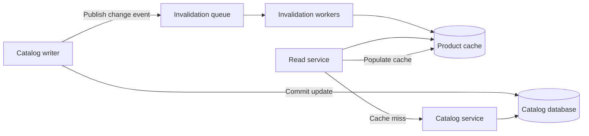
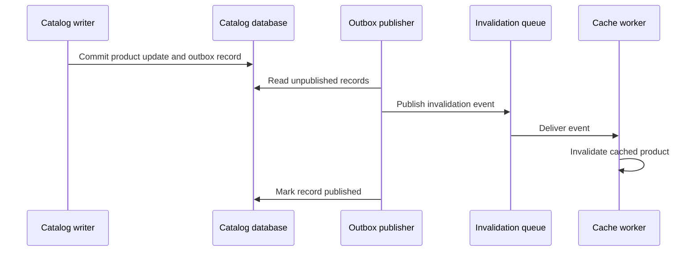

# Why We Replaced TTL-Based Catalog Caching With Event-Driven Invalidation

Our product catalog serves data that changes at uneven rates. Descriptions may remain unchanged for months, while prices and availability can change several times during a sale.

We previously cached catalog responses with a fixed time to live (TTL). The design was simple, but it forced us to choose between two undesirable outcomes:

- Longer TTLs reduced origin traffic but served stale product data.
- Shorter TTLs reduced stale reads but increased origin load and latency risk.

We replaced TTL-based expiry with event-driven invalidation. Over the first four weeks after rollout:

- **Stale reads fell from 3.1% to 0.04% of requests.**
- **p99 latency remained unchanged at 41 ms.**
- **The invalidation queue peaked at 1,200 events per second during a sale day.**

This post describes the architecture, the failure modes we planned for, and what we learned from operating the new system.

## Why TTL Expiry Was No Longer Good Enough

Our read path used a cache-aside pattern:

1. Look up the product in the cache.
2. Return it if present.
3. On a miss, read from the catalog service and populate the cache.
4. Expire the cached value after a fixed interval.

The cache itself was not the problem. Most requests were served quickly, and the catalog service avoided unnecessary read traffic. The problem was that expiration time had become a proxy for data freshness.

If a product changed immediately after its cache entry was written, clients could receive the previous version until the TTL elapsed. Nothing in the system connected a catalog update to the cached copies affected by that update.

Reducing the TTL helped only by narrowing the possible stale window. It did not eliminate the window, and it introduced more cache misses. It also treated every product alike even though update frequency varied significantly across the catalog.

The issue became most visible during promotions. Price and availability changed more frequently at the same time that read traffic increased. Those were precisely the periods when stale data was most damaging and additional origin load was least desirable.

## The New Invalidation Flow

We kept the cache-aside read path but changed how entries become invalid.

When the catalog system commits a product change, it publishes an event identifying the product and its new version. Consumers read those events from a durable queue and invalidate the corresponding cache entries.



The next read after invalidation misses the cache, fetches the current product from the catalog service, and stores the new value.

Events contain the minimum information needed to identify and order a change:

```json
{
  "product_id": "sku_483921",
  "version": 184,
  "changed_at": "2026-08-14T09:32:11Z"
}
```

The version is important. Delivery is at least once, so consumers may receive duplicate events. Queue partitions may also delay one product update relative to another. Workers compare event versions with the version associated with each cache entry and never let an older event invalidate or overwrite knowledge of a newer version.

## Closing the Commit-to-Publish Gap

Publishing directly after a database commit creates a failure window: the catalog update can succeed while event publication fails. In that case, the cache remains stale without any message available for retry.

We addressed this with a transactional outbox. The catalog update and its outbox record are committed in the same database transaction. A separate publisher reads pending outbox records, sends them to the invalidation queue, and marks them as published.



The publisher can send the same record more than once if it fails after publishing but before recording completion. That is why invalidation must be idempotent.

We chose duplicate-safe processing over attempting exactly-once delivery. The former was easier to test and reason about under retries.

## Why We Invalidate Instead of Updating the Cache

We considered writing the new product value into the cache as part of event processing. That can avoid the first cache miss after each update, but it adds several complications:

- Events must contain a complete cacheable representation or trigger another catalog read.
- Cache schema changes become coupled to event schema changes.
- Different cached projections require separate update logic.
- Out-of-order events can overwrite newer values unless every write is version-checked.

Invalidation keeps the event contract narrow. The existing read path remains responsible for constructing cache entries, so there is one source of truth for cache population.

The cost is one miss after an invalidation. For our workload, that cost was preferable to maintaining multiple event-driven cache projections.

## Preventing Races During Repopulation

Invalidation alone does not prevent every stale read. Consider this sequence:

1. A request misses the cache and begins reading product version 10.
2. The product is updated to version 11.
3. The invalidation worker removes the existing cache entry.
4. The original request completes and writes version 10 back into the cache.

This can reintroduce stale data after a valid invalidation.

We prevent that by storing product versions with cache entries and tracking the latest invalidated version. A cache fill is accepted only when its version is not older than the latest version observed for that product.

In simplified form:

```text
on catalog event(product_id, version):
    record latest_version[product_id] = max(current, version)
    delete cache[product_id]

on cache fill(product_id, value, version):
    if version >= latest_version[product_id]:
        write cache[product_id] = (value, version)
```

The real implementation performs the comparison and write atomically. Without that atomicity, two concurrent fills could still reverse the intended ordering.

## TTL Did Not Disappear Entirely

We removed TTL as the primary freshness mechanism, not as a safety mechanism.

Entries still have a long fallback TTL. It protects us from indefinitely retained data if an event is lost because of an unknown defect, an operator error, or corruption outside the guarantees of the queue and outbox.

This distinction matters:

- **Event-driven invalidation controls normal freshness.**
- **Fallback TTL bounds the impact of exceptional failures.**

The fallback is deliberately much longer than our previous operational TTL. It is not expected to participate in routine cache turnover.

## Handling Queue Backlog

A sale day produced the highest observed invalidation load during the four-week measurement window: **1,200 events per second**.

Throughput alone was not our main health signal. Queue age was more useful because it directly approximated how long an update might remain unprocessed. We monitored:

- Age of the oldest unprocessed event
- Time from catalog commit to cache invalidation
- Consumer throughput and retry rate
- Dead-letter queue volume
- Outbox publication lag
- Stale-read rate, grouped by product and change type

Workers scale horizontally based on queue age and depth. Events are partitioned by product identifier so updates for the same product retain their relative order while unrelated products can be processed in parallel.

If consumers fall behind, the cache continues serving reads, but freshness degrades as queue age increases. That is a better failure mode than making the read path depend synchronously on the invalidation service. Cache hits do not wait for the queue or its consumers.

## Rollout and Verification

We rolled out in stages rather than switching expiration policies globally.

First, we published invalidation events without applying them. This let us verify event volume, partition distribution, duplicate frequency, and outbox lag.

Next, consumers processed events in shadow mode. They recorded which keys they would invalidate and compared cached versions with catalog versions, but did not modify the cache.

We then enabled invalidation for a small product cohort and expanded it while watching stale reads, origin load, queue age, and latency. The previous TTL remained active during this phase as a fallback.

We measured stale reads by comparing the version served from the cache with the authoritative product version. We sampled this check to avoid adding a catalog lookup to every request. The same sampling method and rate were used before and after rollout.

## Results After Four Weeks

| Metric | TTL-based expiry | Event-driven invalidation |
|---|---:|---:|
| Stale reads | 3.1% | 0.04% |
| p99 request latency | 41 ms | 41 ms |
| Peak invalidation rate | Not applicable | 1,200 events/s |

The stale-read rate fell by more than 98% relative to the previous system. The remaining **0.04%** includes updates observed within the interval between commit and invalidation, plus cases processed while consumers were recovering from brief delays.

The unchanged **41 ms p99 latency** confirmed an important design goal: freshness coordination stayed outside the synchronous read path. Event publication occurs on the write side, and invalidation processing is asynchronous. Reads continue to interact only with the cache and catalog service.

The sale-day peak also validated the queue-based design. A burst of **1,200 events per second** did not require writers to contact cache nodes directly, and consumers could absorb the workload independently.

## What Became More Complicated

Event-driven invalidation improved freshness, but it was not a free simplification. We added:

- An outbox and publisher
- A durable invalidation queue
- Horizontally scalable consumers
- Product-version metadata
- Atomic version checks during cache population
- Backlog, lag, and dead-letter monitoring
- Replay and reconciliation procedures

Operationally, the system now has more states to inspect. An apparent cache problem may originate in the writer, outbox publisher, queue, consumer fleet, or cache itself.

We also had to define behavior for schema changes and bulk imports. A replayed event must remain understandable long enough to cover the queue’s retention period, and large backfills must not overwhelm the invalidation path.

For teams with low update rates, generous freshness requirements, or a small catalog, this complexity may not be justified. A short TTL can remain the better engineering choice when stale data has limited impact and origin capacity is inexpensive.

## Lessons We Would Apply Again

### Treat invalidation as a data-consistency workflow

Deleting a key is easy. Ensuring that every committed update eventually causes the correct deletion—and that stale work cannot undo newer work—is the difficult part.

Versioning, durable publication, idempotency, and race handling should be part of the initial design rather than follow-up improvements.

### Measure event age, not only queue depth

A deep queue may be healthy if consumers are keeping pace with a burst. A shallow queue may still contain an old, repeatedly failing event. Age and end-to-end invalidation delay were more closely tied to user-visible freshness.

### Keep reads independent of the invalidation system

We did not add queue checks or freshness RPCs to cache hits. This preserved latency and kept an invalidation outage from becoming a read outage.

### Retain a fallback expiry

Even with durable events and retries, a long TTL provides a final bound on stale data. It is cheap protection against failures we have not anticipated.

### Test races explicitly

Happy-path tests were not enough. Our most valuable scenarios covered:

- An update committed while a cache fill was in progress
- Duplicate event delivery
- Out-of-order delivery
- Publisher failure after sending but before acknowledging the outbox record
- Consumer restart during invalidation
- Queue backlog and replay
- Cache unavailability during event processing

## When We Would Choose This Design

Event-driven invalidation is a good fit when:

- Cached data changes unpredictably.
- Stale reads have a measurable product or business cost.
- Reducing TTL would create unacceptable origin load.
- The write path can emit durable change events.
- The team can operate and observe an asynchronous pipeline.

TTL-based caching is still attractive when simplicity matters more than immediate freshness. The relevant question is not whether event-driven invalidation is more sophisticated. It is whether freshness is important enough to justify making data changes—not elapsed time—the mechanism that invalidates the cache.

For our product catalog, the answer was yes. The four-week results showed that we could reduce stale reads from **3.1% to 0.04%** without moving p99 latency from **41 ms**, while handling a measured peak of **1,200 invalidation events per second**.
